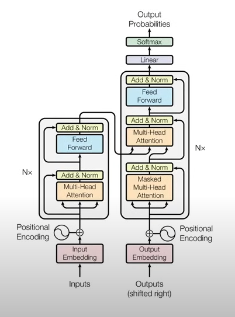

# Transformer

This is a PyTorch implementation of the paper [Attention Is All You Need](https://arxiv.org/abs/1706.03762). The goal of this project is to provide a simple implementation of the paper.

## Theory Explanation

For the Transformers architecture, we can say that it was created as a response to solving the problems that previous models such as LSTM and RNN had and it concerns a very slow calculation process and a problem called the disappearance of gradients. I will not talk about why these problems occur here, but the main focus will be on the general explanation of all the components of this model.
At the very beginning, we can present what the entire architecture of the Transformers model looks like, which can be divided into two main blocks, namely the Encoder and Decoder blocks.

  

### Input Embeddings

The idea of embedding an input vector is quite simple. Considering that this is a standard procedure in the NLP task, we will only say that the goal is to divide the input sequence into separate words and then project it into the embedded space, which then represents a sequence of numbers where each number represents one word. You can see the illustrated view in the picture below.

  

### Positional Encoding
All the words are presented to the Transformer simultaneously. This is a huge difference to recurrent neural networks, e.g. LSTMs, where words are fed successively. However, this means that the order in which words occur in the input sequence is lost. To address this, the Transformer adds a vector to each input embedding, thus injecting some information about the relative or absolute position.

  

  

### Single Head Attention and Multi Head Attention

The Self Attention mechanism allows us to make a correlation between the words in the sentence, that is, the tokens we have created, which do not necessarily have to be just words.
Multi-head attention allows the model to jointly attend to information from different representation subspaces at different positions. The Transformer in the original paper uses eight parallel attention heads. The outputs of the attention heads are concatenated and once again multiplied by an additional weights matrix WO.
In the next two pictures, you will see how self attention is obtained.

  

  

The Multi Head Attention mechanism is a scaled self attention mechanism and its representation is shown in the images below.

  

  

### Normalization

As is a frequent occurrence in different architectures, the normalization of data in layers can represent the key to obtaining stable training and better generalization. The normalization layer is completely different if we compare it with Batch normalization, and the main difference is the normalization axis. Illustrated in the following images:

  

  

### Encoder

Now we have the encoder layer. The Encoders layers job is to map all input sequences into an abstract continuous representation that holds the learned information for that entire sequence. It contains 2 sub-modules, multi-headed attention, followed by a fully connected network. There are also residual connections around each of the two sublayers followed by a layer normalization.

  

### Decoder

The decoder’s job is to generate text sequences. The decoder has a similar sub-layer as the encoder. it has two multi-headed attention layers, a pointwise feed-forward layer, and residual connections, and layer normalization after each sub-layer. These sub-layers behave similarly to the layers in the encoder but each multi-headed attention layer has a different job. The decoder is capped off with a linear layer that acts as a classifier, and a softmax to get the word probabilities.

  

## Usage

## Results